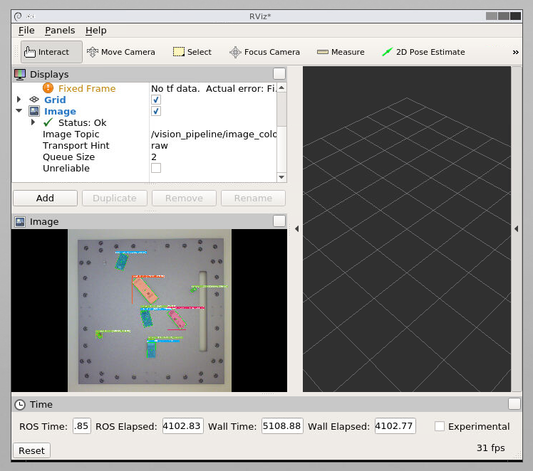
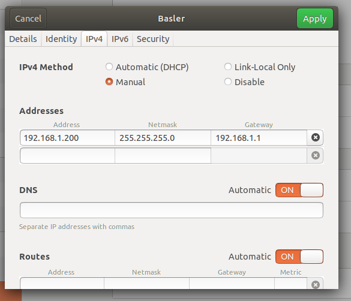

# ROS Package for Vision Pipeline

ROS package that encapsulates the vision pipeline.



## Pylon Basler Camera Software Suite on Docker Host Machine

The Basler camera we are using is: [Basler acA4600-7gc](https://www.baslerweb.com/en/products/cameras/area-scan-cameras/ace/aca4600-7gc).

The camera lens we are using is: [C125-0418-5M-P f4mm](https://www.baslerweb.com/en/products/vision-components/lenses/basler-lens-c125-0418-5m-p-f4mm/).
The f4mm lens has an approximate effective focal length of 23mm. 

In Göttingen we have the lens mounted **67cm** above the work surface. This allows us to capture the entire work surface in the image.  Göttingen also has the [f25mm lens](https://www.baslerweb.com/en/products/vision-components/lenses/basler-lens-c125-2522-5m-p-f25mm/) from Basler. All compatible lenses can be [found here](https://www.baslerweb.com/en/products/vision-components/lenses/#series=baslerace;model=aca46007gc). The f25mm lens has an approximate effective focal length of 150mm. This means that when mounted above the table at 67cm only a small part of the work surface is in the image.

**When mounting the camera higher than 67cm, a different lens to the f4mm should be considered. If not, the work surface will only occupy a part of the image instead of filling the image.**

1. Download and install the Pylon camera software suite.
 Link: [pylon 6.1.1 Camera Software Suite Linux x86 (64 Bit) - Debian Installer Package](https://www.baslerweb.com/de/vertrieb-support/downloads/downloads-software/#type=pylonsoftware;language=all;version=all;os=linuxx8664bit)

2. To connect to the Basler camera over ethernet, create a new ethernet profile with settings:

- IPv4 Method: Manual
- Address: 192.168.1.200
- Netmask: 255.255.255.0
- Gateway: 192.168.1.1



3. Open the pylon viewer (on the host machine) and check that the Basler Camera appears here.

4. Settings to set for the Basler camera in pylon Viewer, see images in notes folder.

!todo, screenshot all the settings

The camera uses the [pypylon api](https://github.com/basler/pypylon) and this is installed in this docker image.

## Nvidia GPU Support


### Installing Nvidia drivers and CUDA on docker host machine

You need to install the Nvidia graphics drivers and the CUDA toolkit. The Nvidia drivers are also bundled with CUDA, but I had trouble installing it this way.

#### **Installing Nvidia graphics drivers**

Prequisites:
```
sudo apt install build-essential libglvnd-dev pkg-config
```
Now [download here the nvidia drivers](https://www.nvidia.com/Download/index.aspx) and run as root to install. The Nvidia drivers require gcc-9 which is what ubuntu ships with by default.

- You may need to disable the built in display driver: [disable display driver](https://docs.nvidia.com/cuda/cuda-installation-guide-linux/index.html#runfile-nouveau)

#### **Installing CUDA toolkit**

Install **CUDA 10.2** on your host system. Go to [Cuda Toolkit Archive](https://developer.nvidia.com/cuda-toolkit-archive) then click on **CUDA Toolkit 10.2**. Select your operating system and download the runfile. Run the runfile using `sudo`.

- You may need gcc version 8 to run CUDA 10.2. If so, run: `sudo apt install gcc-8 g++-8`. [Guide here](https://linuxize.com/post/how-to-install-gcc-on-ubuntu-20-04/) on how to switch gcc versions.

There is an installation guide for CUDA from nvidia [here](https://docs.nvidia.com/cuda/cuda-installation-guide-linux/index.html#runfile-installation). You can have a look at it for reference.

### Docker running as root

First you need to install nvidia-container-runtime, [instructions here](https://nvidia.github.io/nvidia-container-runtime/) and run:
```
sudo apt-get install nvidia-container-runtime
```

Edit `/etc/docker/daemon.json` to contain:

```
{
    "default-runtime":"nvidia",
    "runtimes": {
        "nvidia": {
            "path": "nvidia-container-runtime",
            "runtimeArgs": []
        }
    }
}
```

Then: `sudo systemctl daemon-reload`

Check if runtime is added sucessfully:
`docker info|grep -i runtime`

### Docker running rootless (probably not what you want to do)

Do the same except put the file here: `~/.config/docker/daemon.json`.

Then: `systemctl --user daemon-reload`

Check if runtime is added sucessfully:
`docker info|grep -i runtime`

ONLY INSTALL DOCKER AFTER DOING THESE STEPS IF YOU ARE RUNNING ROOTLESS!

## Running Docker container

Make sure you have everything set up from the previous sections. Install [docker-compose](https://docs.docker.com/compose/install/).

Edit the `docker-compose.yml` file and remove the ROS master and Rviz if you already have these running elsewhere. In principle the `docker-compose.yml` file in its current state will provide you with a ROS master, and Rviz that can be accessed via the browser through the `novnc` container.

The container is running in `host` mode because this is the easiest way to give it access to the Basler camera. The `ROS_IP` needs to be set correctly. Do this by running `$ hostname -I` on the host and setting the `ROS_IP` to this IP (take the first one if it gives multiple IP addresses).

Clone the [https://github.com/ReconCycle/vision-pipeline](https://github.com/ReconCycle/vision-pipeline) project. ** Cloning this repository requires git LFS.** Set the path of the project in the `volumes` section of the `docker-compose.yml`. This is the path before the ":" sign. Do not change `/root/vision-pipeline`.

```
volumes:
  - $HOME/projects/vision-pipeline:/root/vision-pipeline
```

At some point we might want the project to be cloned automatically  in this docker container (instead of using a volume), and that is what the `.env.sample` file is for. Currently I am not doing this, so you don't need to add an app password to the `.env` file.

### Running

Run:
```
$ cd ros-vision-pipeline
$ docker-compose up -d
```
The container should now be running, but it will not do anything on its own. Run:
```
docker-compose exec ros-vision-pipeline bash
```
You are now inside the docker container. Run:
```
cd vision-pipeline
```
To check that the Basler camera is working run:
```
python ros_camera_test.py
```
You should be able to see the live camera feed in Rviz on the node `/camera/image_color`.

To run the vision-pipeline run:
```
python ros_pipeline.py
```
The `ros_pipeline.py` script can take the following arguments:
- publish_continuously (default False): Publish labelled images and detections continuously
                    otherwise create a service.
- publish_on_service_call (default True): When a service call is received, also publish the
                    image and detections

Now you should be able to use the following nodes:

- `/camera/image_color` camera image (undistorted),
- `/vision_pipeline/image_color` labelled camera image (undistorted),
- `/vision_pipeline/data` JSON string of detections.

The JSON string is a list where each object in the list represents a detection and has the following attributes:

- `class_name` the class name of the detection,
- `score` the detection score. Float in the interval [0, 1] for how confident the model is in the prediction,
- `obb_corners` the corners of the oriented bounding box in a list of x, y coordinates in meters,
- `obb_center` x, y coordinates of oriented bounding box center in meters,
- `obb_rot_quat` rotation quaternion of the oriented bounding box.

The list of possible class names is: front, back, side1, side2, battery, pcb, and internals. Where: front, back, side1, and side2, correspond to the poses of the h.c.a.

There is a ROS service called `get_detection`. This service is only created when `ros_pipeline.py` is started with the argument `publish_continuously False`, which is the default. The service will return the following:
```
bool success
sensor_msgs/Image image
string detections
```
This has been defined in `build/ros_vision_pipeline_srv/Detection.srv`.

## Resources

Python with ROS:

- http://www.artificialhumancompanions.com/structure-python-based-ros-package/
- https://docs.freedomrobotics.ai/docs/ros-development-in-docker-on-mac-and-windows

ROS series on Python Package:

- http://wiki.ros.org/ROS/Tutorials/CreatingPackage
- http://wiki.ros.org/ROS/Tutorials/ExaminingPublisherSubscriber
- http://wiki.ros.org/ROS/Tutorials/WritingPublisherSubscriber%28python%29

ROS docker setup:

- https://github.com/gramaziokohler/ros_docker
- https://github.com/ReconCycle/docker_examples/blob/master/compose_files/ros1_echo/docker-compose.yml

Alternative method without requiring to use ROS directly:

- https://github.com/gramaziokohler/roslibpy

ROS opencv cv_bridge:

- https://stackoverflow.com/questions/49221565/unable-to-use-cv-bridge-with-ros-kinetic-and-python3

Publish/Subscribe to Images in ROS:

- https://stackoverflow.com/questions/55377442/how-to-subscribe-and-publish-images-in-ros
- https://stackoverflow.com/questions/58590277/how-to-use-opencv-python-in-ros

ROS incompatibility with OpenCV Python3:

- https://stackoverflow.com/questions/43019951/after-install-ros-kinetic-cannot-import-opencv 

ROS Yolact:

- https://github.com/Eruvae/yolact_ros

Supervisors

- https://github.com/just-containers/s6-overlay#quickstart

Reduce docker size:

TODO

- https://jcristharif.com/conda-docker-tips.html
